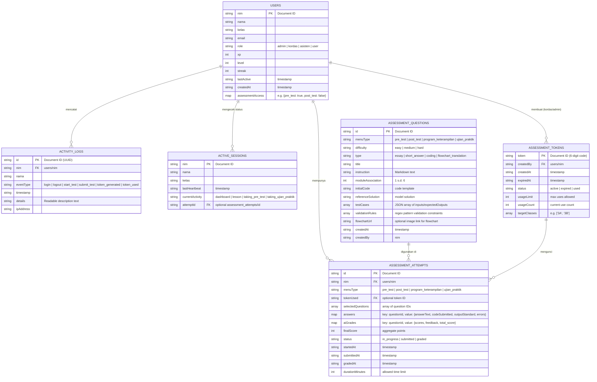

# Entity Relationship Diagram (ERD) & Skema Database
## Fitur Asesmen (Pre-Test, Post-Test, Program Keterampilan, Ujian Praktik) & Monitoring Aktivitas

| Dokumen | Entity Relationship Diagram (ERD) & Database Schema |
|---|---|
| **Database Utama** | Cloud Firestore (NoSQL Document-based Database) |
| **Database Sinkronisasi** | Supabase (PostgreSQL Relational Database) |

---

## 1. Diagram Hubungan Entitas (ERD)

Berikut adalah visualisasi hubungan data menggunakan diagram **Mermaid**. Hubungan ini memetakan interaksi data antara pengguna, bank soal, sesi pengerjaan, token ujian, dan log audit.



---

## 2. Struktur Detail Koleksi Firestore (NoSQL Schema)

Berikut adalah penjelasan skema struktur data per koleksi di Cloud Firestore.

### A. Koleksi: `users`
* **Path**: `/users/{nim}`
* **Deskripsi**: Menyimpan data profil pengguna, peran (RBAC), serta status perizinan menu asesmen.
* **Skema**:
```json
{
  "nim": "220192831",
  "nama": "Farhan Adityo",
  "kelas": "3A - Teknik Informatika",
  "email": "farhan@student.ac.id",
  "role": "user", // "admin", "kordas", "asisten", "user"
  "xp": 450,
  "level": 3,
  "streak": 5,
  "lastActive": "2026-06-06T07:15:30.000Z",
  "createdAt": "2026-05-10T04:20:11.000Z",
  "photoURL": null,
  "assessmentAccess": {
    "pre_test": true,         // Diizinkan mengerjakan pre-test
    "post_test": true,        // Diizinkan mengerjakan post-test
    "program_keterampilan": false, // Dikunci oleh asisten
    "ujian_praktik": false    // Dikunci oleh asisten
  }
}
```

---

### B. Koleksi: `assessment_questions`
* **Path**: `/assessment_questions/{questionId}`
* **Deskripsi**: Bank soal lengkap untuk semua menu asesmen.
* **Skema**:
```json
{
  "id": "q_pre_med_01",
  "menuType": "pre_test", // pre_test, post_test, program_keterampilan, ujian_praktik
  "difficulty": "medium", // easy, medium, hard
  "type": "short_answer", // essay, short_answer, coding, flowchart_translation
  "title": "Menganalisis Perulangan Nested Loop",
  "instruction": "Tuliskan output dari kode C di bawah ini serta berikan penjelasan singkat mengapa output tersebut muncul.",
  "moduleAssociation": 2, // Asosiasi modul 1-6 (untuk ujian praktik)
  "initialCode": "#include <stdio.h>\nint main() {\n  for(int i=0; i<2; i++) {\n    for(int j=0; j<2; j++) {\n      printf(\"%d \", i+j);\n    }\n  }\n  return 0;\n}",
  "referenceSolution": "Output: 0 1 1 2. Penjelasan: Perulangan i=0 berjalan dengan j=0 (cetak 0) dan j=1 (cetak 1). Lalu i=1 berjalan dengan j=0 (cetak 1) dan j=1 (cetak 2).",
  "testCases": [], // Kosong untuk short_answer/essay
  "validationRules": [], 
  "flowchartUrl": "", // Diisi jika tipe 'flowchart_translation'
  "createdAt": "2026-06-06T02:00:00.000Z",
  "createdBy": "199208031" // NIM Kordas
}
```

---

### C. Koleksi: `assessment_attempts`
* **Path**: `/assessment_attempts/{attemptId}`
* **Deskripsi**: Menyimpan rekaman riwayat pengerjaan mahasiswa, kode yang dikirim, dan penilaian terperinci dari AI.
* **Skema**:
```json
{
  "id": "att_220192831_pretest_001",
  "nim": "220192831",
  "menuType": "pre_test",
  "tokenUsed": null,
  "selectedQuestions": ["q_pre_easy_02", "q_pre_med_01", "q_pre_med_05", "q_pre_hard_01", "q_pre_hard_03"],
  "answers": {
    "q_pre_med_01": {
      "answerText": "Outputnya 0 1 1 2 karena nested loop menjumlahkan i dan j di setiap iterasi.",
      "codeSubmitted": "",
      "outputStandard": "",
      "errors": ""
    },
    "q_pre_hard_01": {
      "answerText": "",
      "codeSubmitted": "#include <stdio.h>\nint main() {\n ... \n}",
      "outputStandard": "Output sukses",
      "errors": null
    }
  },
  "aiGrades": {
    "q_pre_med_01": {
      "scores": {
        "correctness": 10,
        "explanation": 5
      },
      "total_score": 15,
      "feedback": "Jawaban benar dan penjelasan logis."
    }
  },
  "finalScore": 85,
  "status": "graded", // in_progress, submitted, graded
  "startedAt": "2026-06-06T07:00:00.000Z",
  "submittedAt": "2026-06-06T07:45:00.000Z",
  "gradedAt": "2026-06-06T07:46:12.000Z",
  "durationMinutes": 60
}
```

---

### D. Koleksi: `assessment_tokens`
* **Path**: `/assessment_tokens/{token}`
* **Deskripsi**: Berisi daftar token aktif untuk mengunci menu Ujian Praktik.
* **Skema**:
```json
{
  "token": "XP99A2",
  "createdBy": "199208031", // NIM Admin/Kordas
  "createdAt": "2026-06-06T06:30:00.000Z",
  "expiredAt": "2026-06-06T12:00:00.000Z",
  "status": "active", // active, expired, used
  "usageLimit": 40,   // Dapat digunakan maksimal oleh 40 mahasiswa
  "usageCount": 18,   // Saat ini telah digunakan oleh 18 mahasiswa
  "targetClasses": ["3A", "3B"]
}
```

---

### E. Koleksi: `activity_logs`
* **Path**: `/activity_logs/{logId}`
* **Deskripsi**: Log audit aktivitas sistem (Write-only bagi pengguna biasa, read-only bagi asisten/kordas/admin).
* **Skema**:
```json
{
  "id": "log_550e8400-e29b-41d4-a716-446655440000",
  "nim": "220192831",
  "nama": "Farhan Adityo",
  "eventType": "token_used", // login, logout, start_test, submit_test, token_generated, token_used
  "timestamp": "2026-06-06T07:01:15.000Z",
  "details": "Menggunakan token 'XP99A2' untuk mengakses Ujian Praktik",
  "ipAddress": "192.168.1.15"
}
```

---

### F. Koleksi: `active_sessions`
* **Path**: `/active_sessions/{nim}`
* **Deskripsi**: Dipakai untuk tracking status real-time ("Who is currently working") secara dinamis menggunakan Firestore Snapshot.
* **Skema**:
```json
{
  "nim": "220192831",
  "nama": "Farhan Adityo",
  "kelas": "3A",
  "lastHeartbeat": "2026-06-06T07:15:00.000Z", // Diupdate client per 30 detik
  "currentActivity": "taking_ujian_praktik", // dashboard, lesson, taking_pre_test, taking_ujian_praktik
  "attemptId": "att_220192831_pretest_001"
}
```

---

## 3. Sinkronisasi PostgreSQL (Supabase elearning_progress Schema)

Nilai akhir dari asesmen ini akan direkap ke dalam Supabase untuk keperluan rekap nilai utama.

### Tabel: `elearning_progress` (Updated)
Ketika nilai mahasiswa dikalkulasi, data hasil asesmen akan disinkronisasikan ke Supabase melalui REST API `/api/report`. Kolom tambahan akan ditambahkan ke tabel `elearning_progress`:

```sql
-- Tambah kolom asesmen di tabel Supabase
ALTER TABLE elearning_progress 
ADD COLUMN IF NOT EXISTS pre_test_score INT DEFAULT NULL,
ADD COLUMN IF NOT EXISTS post_test_score INT DEFAULT NULL,
ADD COLUMN IF NOT EXISTS skill_program_score INT DEFAULT NULL,
ADD COLUMN IF NOT EXISTS ujian_praktik_score INT DEFAULT NULL,
ADD COLUMN IF NOT EXISTS assessment_status JSONB DEFAULT '{}'::jsonb;
```

Struktur data JSON `assessment_status` pada Supabase:
```json
{
  "pre_test": {
    "score": 85,
    "status": "graded",
    "completed_at": "2026-06-06T07:46:12Z"
  },
  "post_test": {
    "score": 90,
    "status": "graded",
    "completed_at": "2026-06-06T09:15:00Z"
  }
}
```
