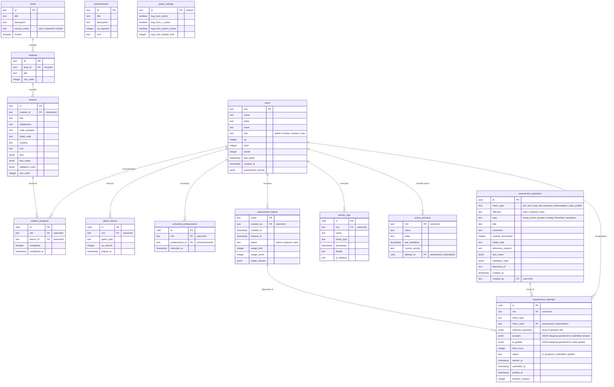

# Entity Relationship Diagram (ERD) & Skema Database
## Arsitektur Relasional Supabase PostgreSQL

Dokumen ini mendefinisikan rancangan tabel relasional, tipe data, kunci primer/asing, dan kebijakan keamanan **Row Level Security (RLS)** untuk migrasi penuh dari Firebase ke **Supabase (PostgreSQL)**.

---

## 1. Diagram Relasional Database (ERD)



---

## 2. Supabase SQL DDL (PostgreSQL Migration Script)

Jalankan perintah SQL ini di dalam **Supabase SQL Editor** untuk membangun skema tabel relasional:

```sql
-- =========================================================================
-- 1. EXTENSIONS & ENUMS
-- =========================================================================
CREATE EXTENSION IF NOT EXISTS "uuid-ossp";

-- =========================================================================
-- 2. TABEL PENGGUNA & SETTING
-- =========================================================================
CREATE TABLE users (
    nim TEXT PRIMARY KEY,
    nama TEXT NOT NULL,
    kelas TEXT NOT NULL,
    email TEXT,
    role TEXT NOT NULL DEFAULT 'user' CHECK (role IN ('admin', 'kordas', 'asisten', 'user')),
    xp INTEGER NOT NULL DEFAULT 0 CHECK (xp >= 0),
    level INTEGER NOT NULL DEFAULT 1 CHECK (level >= 1),
    streak INTEGER NOT NULL DEFAULT 0 CHECK (streak >= 0),
    last_active TIMESTAMP WITH TIME ZONE DEFAULT TIMEZONE('utc'::text, NOW()),
    created_at TIMESTAMP WITH TIME ZONE DEFAULT TIMEZONE('utc'::text, NOW()),
    assessment_access JSONB NOT NULL DEFAULT '{"pre_test": false, "post_test": false, "program_keterampilan": false, "ujian_praktik": false}'::jsonb
);

CREATE TABLE game_settings (
    id TEXT PRIMARY KEY DEFAULT 'default',
    bug_hunt_active BOOLEAN NOT NULL DEFAULT TRUE,
    bug_hunt_c_active BOOLEAN NOT NULL DEFAULT TRUE,
    bug_hunt_python_active BOOLEAN NOT NULL DEFAULT TRUE,
    bug_hunt_weekly_limit INTEGER NOT NULL DEFAULT 3 CHECK (bug_hunt_weekly_limit >= 0)
);

CREATE TABLE game_questions (
    id UUID PRIMARY KEY DEFAULT uuid_generate_v4(),
    language TEXT NOT NULL CHECK (language IN ('c', 'python')),
    difficulty TEXT NOT NULL CHECK (difficulty IN ('easy', 'medium', 'hard')),
    title TEXT NOT NULL,
    code TEXT NOT NULL,
    bug_line INTEGER NOT NULL,
    explanation TEXT NOT NULL
);


-- =========================================================================
-- 3. TABEL KURIKULUM & MATERI
-- =========================================================================
CREATE TABLE levels (
    id TEXT PRIMARY KEY,
    title TEXT NOT NULL,
    description TEXT,
    access_mode TEXT NOT NULL DEFAULT 'auto' CHECK (access_mode IN ('auto', 'unlocked', 'locked')),
    locked BOOLEAN NOT NULL DEFAULT FALSE
);

CREATE TABLE modules (
    id TEXT PRIMARY KEY,
    level_id TEXT REFERENCES levels(id) ON DELETE CASCADE,
    title TEXT NOT NULL,
    sort_order INTEGER NOT NULL DEFAULT 0
);

CREATE TABLE lessons (
    id TEXT PRIMARY KEY,
    module_id TEXT REFERENCES modules(id) ON DELETE CASCADE,
    title TEXT NOT NULL,
    explanation TEXT NOT NULL,
    code_example TEXT NOT NULL,
    initial_code TEXT NOT NULL,
    solution TEXT NOT NULL,
    hint TEXT,
    quiz JSONB NOT NULL DEFAULT '{}'::jsonb,
    test_cases JSONB NOT NULL DEFAULT '[]'::jsonb,
    validation_rules JSONB NOT NULL DEFAULT '[]'::jsonb,
    sort_order INTEGER NOT NULL DEFAULT 0
);

-- =========================================================================
-- 4. TABEL PROGRESS & PENCAPAIAN
-- =========================================================================
CREATE TABLE student_progress (
    id UUID PRIMARY KEY DEFAULT uuid_generate_v4(),
    nim TEXT REFERENCES users(nim) ON DELETE CASCADE,
    lesson_id TEXT REFERENCES lessons(id) ON DELETE CASCADE,
    completed BOOLEAN NOT NULL DEFAULT TRUE,
    completed_at TIMESTAMP WITH TIME ZONE DEFAULT TIMEZONE('utc'::text, NOW()),
    CONSTRAINT unique_nim_lesson UNIQUE (nim, lesson_id)
);

CREATE TABLE game_history (
    id UUID PRIMARY KEY DEFAULT uuid_generate_v4(),
    nim TEXT REFERENCES users(nim) ON DELETE CASCADE,
    game_type TEXT NOT NULL,
    xp_earned INTEGER NOT NULL CHECK (xp_earned <= 300),
    played_at TIMESTAMP WITH TIME ZONE DEFAULT TIMEZONE('utc'::text, NOW())
);

CREATE TABLE achievements (
    id TEXT PRIMARY KEY,
    title TEXT NOT NULL,
    description TEXT,
    icon TEXT,
    requirement_type TEXT NOT NULL,
    requirement_value TEXT NOT NULL
);

CREATE TABLE unlocked_achievements (
    id UUID PRIMARY KEY DEFAULT uuid_generate_v4(),
    nim TEXT REFERENCES users(nim) ON DELETE CASCADE,
    achievement_id TEXT REFERENCES achievements(id) ON DELETE CASCADE,
    unlocked_at TIMESTAMP WITH TIME ZONE DEFAULT TIMEZONE('utc'::text, NOW()),
    CONSTRAINT unique_nim_achievement UNIQUE (nim, achievement_id)
);

-- =========================================================================
-- 5. TABEL ASESMEN & UJIAN
-- =========================================================================
CREATE TABLE assessment_questions (
    id UUID PRIMARY KEY DEFAULT uuid_generate_v4(),
    menu_type TEXT NOT NULL CHECK (menu_type IN ('pre_test', 'post_test', 'program_keterampilan', 'ujian_praktik')),
    difficulty TEXT NOT NULL CHECK (difficulty IN ('easy', 'medium', 'hard')),
    type TEXT NOT NULL CHECK (type IN ('essay', 'short_answer', 'coding', 'flowchart_translation')),
    title TEXT NOT NULL,
    instruction TEXT NOT NULL,
    module_association INTEGER CHECK (module_association BETWEEN 1 AND 6),
    initial_code TEXT,
    reference_solution TEXT,
    test_cases JSONB NOT NULL DEFAULT '[]'::jsonb,
    validation_rules JSONB NOT NULL DEFAULT '[]'::jsonb,
    flowchart_url TEXT,
    created_at TIMESTAMP WITH TIME ZONE DEFAULT TIMEZONE('utc'::text, NOW()),
    created_by TEXT REFERENCES users(nim) ON DELETE SET NULL
);

CREATE TABLE assessment_tokens (
    token TEXT PRIMARY KEY,
    created_by TEXT REFERENCES users(nim) ON DELETE SET NULL,
    created_at TIMESTAMP WITH TIME ZONE DEFAULT TIMEZONE('utc'::text, NOW()),
    expired_at TIMESTAMP WITH TIME ZONE NOT NULL,
    status TEXT NOT NULL DEFAULT 'active' CHECK (status IN ('active', 'expired', 'used')),
    usage_limit INTEGER NOT NULL DEFAULT 1 CHECK (usage_limit >= 1),
    usage_count INTEGER NOT NULL DEFAULT 0 CHECK (usage_count >= 0),
    target_classes JSONB NOT NULL DEFAULT '[]'::jsonb
);

CREATE TABLE assessment_attempts (
    id UUID PRIMARY KEY DEFAULT uuid_generate_v4(),
    nim TEXT REFERENCES users(nim) ON DELETE CASCADE,
    menu_type TEXT NOT NULL,
    token_used TEXT REFERENCES assessment_tokens(token) ON DELETE SET NULL,
    selected_questions JSONB NOT NULL DEFAULT '[]'::jsonb,
    answers JSONB NOT NULL DEFAULT '{}'::jsonb,
    ai_grades JSONB NOT NULL DEFAULT '{}'::jsonb,
    final_score INTEGER DEFAULT NULL,
    status TEXT NOT NULL DEFAULT 'in_progress' CHECK (status IN ('in_progress', 'submitted', 'graded')),
    started_at TIMESTAMP WITH TIME ZONE DEFAULT TIMEZONE('utc'::text, NOW()),
    submitted_at TIMESTAMP WITH TIME ZONE,
    graded_at TIMESTAMP WITH TIME ZONE,
    duration_minutes INTEGER NOT NULL
);

-- =========================================================================
-- 6. MONITORING & AUDIT LOGS
-- =========================================================================
CREATE TABLE activity_logs (
    id UUID PRIMARY KEY DEFAULT uuid_generate_v4(),
    nim TEXT REFERENCES users(nim) ON DELETE SET NULL,
    nama TEXT NOT NULL,
    event_type TEXT NOT NULL,
    timestamp TIMESTAMP WITH TIME ZONE DEFAULT TIMEZONE('utc'::text, NOW()),
    details TEXT NOT NULL,
    ip_address TEXT
);

CREATE TABLE active_sessions (
    nim TEXT PRIMARY KEY REFERENCES users(nim) ON DELETE CASCADE,
    nama TEXT NOT NULL,
    kelas TEXT NOT NULL,
    last_heartbeat TIMESTAMP WITH TIME ZONE DEFAULT TIMEZONE('utc'::text, NOW()),
    current_activity TEXT NOT NULL,
    attempt_id UUID REFERENCES assessment_attempts(id) ON DELETE SET NULL
);
```

---

## 3. Kebijakan Keamanan Row Level Security (RLS)

PostgreSQL menyediakan Row Level Security (RLS) untuk membatasi akses baca/tulis baris tabel secara langsung dari client SDK Supabase.

```sql
-- Mengaktifkan RLS pada tabel-tabel krusial
ALTER TABLE users ENABLE ROW LEVEL SECURITY;
ALTER TABLE student_progress ENABLE ROW LEVEL SECURITY;
ALTER TABLE assessment_attempts ENABLE ROW LEVEL SECURITY;
ALTER TABLE assessment_questions ENABLE ROW LEVEL SECURITY;
ALTER TABLE assessment_tokens ENABLE ROW LEVEL SECURITY;
ALTER TABLE active_sessions ENABLE ROW LEVEL SECURITY;
ALTER TABLE activity_logs ENABLE ROW LEVEL SECURITY;

-- =========================================================================
-- HELPER FUNCTIONS FOR RLS (Mengecek NIM dan Peran User dari Metadata JWT)
-- =========================================================================
CREATE OR REPLACE FUNCTION auth.nim() 
RETURNS TEXT AS $$
  -- Mendapatkan NIM mahasiswa dari JWT Claim custom 'nim' atau auth.uid()
  SELECT COALESCE(
    nullif(current_setting('request.jwt.claims', true)::json->>'nim', ''),
    current_setting('request.jwt.claims', true)::json->>'sub'
  )::text;
$$ LANGUAGE sql STABLE;

CREATE OR REPLACE FUNCTION auth.role() 
RETURNS TEXT AS $$
  -- Mendapatkan role user dari JWT Claim custom
  SELECT COALESCE(
    current_setting('request.jwt.claims', true)::json->>'role',
    'user'
  )::text;
$$ LANGUAGE sql STABLE;

-- =========================================================================
-- KEBIJAKAN (POLICIES) RLS
-- =========================================================================

-- A. Kebijakan untuk Tabel: users
CREATE POLICY "Mahasiswa hanya bisa baca & ubah data miliknya sendiri" ON users
    FOR ALL USING (nim = auth.nim());

CREATE POLICY "Asisten ke atas bisa membaca data seluruh user" ON users
    FOR SELECT USING (auth.role() IN ('admin', 'kordas', 'asisten'));

CREATE POLICY "Admin & Kordas bisa melakukan modifikasi seluruh user" ON users
    FOR ALL USING (auth.role() IN ('admin', 'kordas'));

-- B. Kebijakan untuk Tabel: student_progress
CREATE POLICY "Mahasiswa hanya bisa modifikasi progress-nya sendiri" ON student_progress
    FOR ALL USING (nim = auth.nim());

CREATE POLICY "Asisten ke atas bisa melihat progress semua mahasiswa" ON student_progress
    FOR SELECT USING (auth.role() IN ('admin', 'kordas', 'asisten'));

-- C. Kebijakan untuk Tabel: assessment_attempts
CREATE POLICY "Mahasiswa hanya bisa baca & tulis attempt miliknya" ON assessment_attempts
    FOR ALL USING (nim = auth.nim());

CREATE POLICY "Asisten ke atas bisa membaca attempt semua mahasiswa" ON assessment_attempts
    FOR SELECT USING (auth.role() IN ('admin', 'kordas', 'asisten'));

CREATE POLICY "Staf pengajar bisa menilai (update) attempt mahasiswa" ON assessment_attempts
    FOR UPDATE USING (auth.role() IN ('admin', 'kordas', 'asisten'));

-- D. Kebijakan untuk Tabel: assessment_questions
CREATE POLICY "Semua user terautentikasi bisa membaca bank soal" ON assessment_questions
    FOR SELECT USING (auth.role() IS NOT NULL);

CREATE POLICY "Hanya Admin & Kordas yang bisa mengelola bank soal" ON assessment_questions
    FOR ALL USING (auth.role() IN ('admin', 'kordas'));

-- E. Kebijakan untuk Tabel: assessment_tokens
CREATE POLICY "Semua user bisa melakukan verifikasi token" ON assessment_tokens
    FOR SELECT USING (auth.role() IS NOT NULL);

CREATE POLICY "Hanya Admin & Kordas yang bisa membuat token" ON assessment_tokens
    FOR ALL USING (auth.role() IN ('admin', 'kordas'));

-- F. Kebijakan untuk Tabel: active_sessions
CREATE POLICY "Mahasiswa bisa update session heartbeat miliknya" ON active_sessions
    FOR ALL USING (nim = auth.nim());

CREATE POLICY "Asisten ke atas bisa memonitor seluruh sesi aktif" ON active_sessions
    FOR SELECT USING (auth.role() IN ('admin', 'kordas', 'asisten'));

-- G. Kebijakan untuk Tabel: activity_logs
CREATE POLICY "Mahasiswa hanya bisa menulis log aktivitas" ON activity_logs
    FOR INSERT WITH CHECK (nim = auth.nim());

CREATE POLICY "Asisten ke atas bisa membaca seluruh log audit" ON activity_logs
    FOR SELECT USING (auth.role() IN ('admin', 'kordas', 'asisten'));
```

---

## 4. Keuntungan Migrasi Relasional PostgreSQL (Supabase)
1. **Integritas Relasional**: Soal, pelajaran, modul, dan level kini memiliki integritas referensial (`FOREIGN KEY ON DELETE CASCADE`), mencegah data yatim piatu (orphan data) seperti di NoSQL Firestore.
2. **Kueri Agregat Efisien**: Menghitung rata-rata nilai per-kelas, progres per-angkatan, dan distribusi kriteria rubrik dapat dilakukan langsung via query `SELECT AVG(final_score)` SQL yang tangguh, memangkas beban pemrosesan logika di client browser.
3. **Penyimpanan Struktur Kompleks yang Kuat**: Struktur data nested seperti `test_cases`, `answers`, dan hasil penilaian AI disimpan aman sebagai tipe data **JSONB**, yang tetap mendukung fitur kueri indeks (indexing) di PostgreSQL.
4. **Realtime Broadcast Native**: Menggunakan Supabase Channels untuk monitoring heartbeat mahasiswa aktif secara instan dan efisien dibandingkan metode snapshot Firestore yang memicu biaya baca dokumen yang tinggi.
