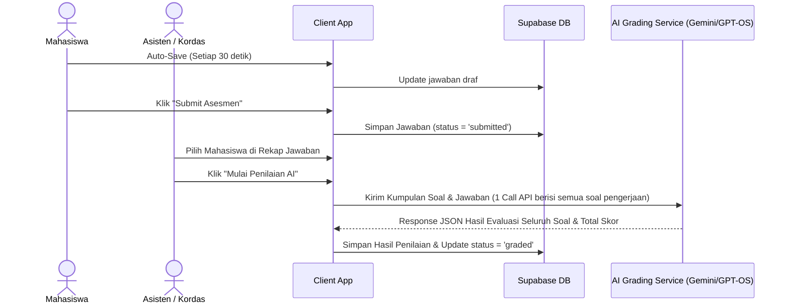

# Product Requirement Document (PRD)
## Fitur Asesmen, Monitoring Aktivitas, Auto-Save, & Migrasi Supabase

| Dokumen | Product Requirement Document (PRD) |
|---|---|
| **Fitur** | Menu Asesmen, Monitoring Dashboard, Auto-Save, & Arsitektur Supabase |
| **Status** | Draft (Planning Mode - Updated v2) |
| **Target Pengguna** | Mahasiswa (Student), Asisten Laboratorium (Assistant), Koordinator Asisten (Kordas), Admin |
| **Model Evaluasi** | AI-Powered Grading (Gemini / Custom Model GPT-OS) - Batch Evaluation by Assistant |

---

## 1. Latar Belakang & Tujuan
Untuk mengukur dan mengevaluasi pemahaman mahasiswa secara berkala dan objektif, sistem E-Learning memerlukan fitur asesmen terstruktur yang terpisah dari alur belajar mandiri biasa. Terdapat empat jenis asesmen baru yang dirancang dengan karakteristik jumlah soal, tingkat kesulitan, dan kriteria penilaian yang spesifik.

**Pembaharuan Alur AI Grading (Batch Evaluation & Multi-Model)**:
- Penilaian AI dipicu secara manual oleh **Asisten/Kordas/Admin** via dashboard (single/bulk choice).
- **Optimalisasi Call API**: AI mengevaluasi **seluruh soal dalam satu pengerjaan mahasiswa sekaligus (batch/single-call)** daripada melakukan call terpisah per-soal. Sebagai contoh, untuk Pre-Test (5 soal), sistem hanya melakukan 1 call API Gemini dengan menyematkan 5 soal dan 5 jawaban mahasiswa sekaligus. Hal ini memangkas konsumsi kuota API sebesar 80% dan mempercepat durasi penilaian massal.
- **Dukungan Multi-Model**: Sistem mendukung rotasi kunci API (key rotation) serta integrasi model eksternal/Lokal (seperti GPT Open Source 120B / DeepSeek) untuk menangani request massal tanpa terhambat batas rate limit.

**Auto-Save & Rekap Jawaban**:
- **Auto-Save**: Sistem melakukan sinkronisasi otomatis draf jawaban mahasiswa ke database Supabase setiap 30 detik (atau saat berpindah soal) untuk mencegah kehilangan data akibat listrik padam atau browser crash.
- **Rekap Jawaban**: Dashboard Monitoring menyediakan sub-menu rekap jawaban untuk memantau status penyimpanan draf jawaban mahasiswa (apakah sudah terisi, masih kosong, atau sudah disubmit) sebelum penilaian dimulai.

---

## 2. Matriks Peran & Hak Akses (Role-Based Access Control)
Sistem memiliki 4 peran pengguna dengan kewenangan sebagai berikut:

| Hak Akses / Fitur | Student (`user`) | Assistant (`asisten`) | Kordas (`kordas`) | Admin (`admin`) |
|---|:---:|:---:|:---:|:---:|
| Mengerjakan Asesmen yang Terbuka | ✅ | ❌ | ❌ | ❌ |
| Auto-Save Jawaban Berkala | ✅ | ❌ | ❌ | ❌ |
| Memasukkan Token Ujian Praktik | ✅ | ❌ | ❌ | ❌ |
| Melihat Nilai & Riwayat Sendiri | ✅ | ❌ | ❌ | ❌ |
| Memonitor Aktivitas Mahasiswa Real-Time | ❌ | ✅ | ✅ | ✅ |
| Melihat Rekap Jawaban Mahasiswa | ❌ | ✅ | ✅ | ✅ |
| Memicu Penilaian AI Mahasiswa (Single / Bulk Choice) | ❌ | ✅ | ✅ | ✅ |
| Melihat Log Aktivitas Pengguna | ❌ | ✅ | ✅ | ✅ |
| Membuka/Mengunci Menu Asesmen Mahasiswa | ❌ | ✅ | ✅ | ✅ |
| Mengelola Bank Soal Asesmen (CRUD) | ❌ | ❌ | ✅ | ✅ |
| Membuat & Mengelola Token Ujian Praktik | ❌ | ❌ | ✅ | ✅ |
| Konfigurasi Aturan Global / Model AI | ❌ | ❌ | ❌ | ✅ |

---

## 3. Spesifikasi 4 Menu Asesmen
Setiap menu asesmen memiliki struktur, distribusi soal, dan sistem penilaian yang khas.

### A. Pre-Test
* **Tujuan**: Mengukur pemahaman awal mahasiswa sebelum memasuki materi utama.
* **Jumlah Soal**: 5 Soal (1 Easy, 2 Medium, 2 Hard).
* **Alur Pemilihan Soal**: Soal diambil secara acak (randomized) dari bank soal khusus Pre-Test sesuai dengan kriteria kesulitan yang ditentukan.
* **Format Soal & Rubrik Penilaian**:
  1. **Easy (1 Soal - Pilihan Ganda / Jawaban Singkat)**:
     - *Jawaban Benar*: +20 Poin
     - *Jawaban Salah*: +8 Poin
     - *Jawaban Kosong/Tidak Diisi*: 0 Poin
  2. **Medium (2 Soal - Jawaban Singkat + Penjelasan Logika)**:
     - *Jawaban Benar Singkat (Tanpa Penjelasan)*: +10 Poin per soal
     - *Jawaban Benar + Penjelasan Tepat*: +15 Poin per soal
     - *Jawaban Salah + Penjelasan Logis*: +7 Poin per soal
     - *Jawaban Salah*: +3 Poin per soal
     - *Jawaban Kosong*: 0 Poin
  3. **Hard (2 Soal - Analisis Logika + Coding Sederhana / Penjelasan Mendalam)**:
     - *Jawaban Benar Singkat*: +15 Poin per soal
     - *Jawaban Benar + Penjelasan*: +25 Poin per soal
     - *Jawaban Salah + Penjelasan Logis*: +10 Poin per soal
     - *Jawaban Salah*: +5 Poin per soal
     - *Jawaban Kosong*: 0 Poin
* **Total Maksimal Poin**: 20 + (2 * 15) + (2 * 25) = **100 Poin**.

---

### B. Post-Test
* **Tujuan**: Mengukur tingkat penguasaan materi setelah menyelesaikan level tertentu.
* **Jumlah Soal**: 3 Soal (1 Easy, 1 Medium, 1 Hard Coding).
* **Alur Pemilihan Soal**: Diambil acak dari bank soal khusus Post-Test sesuai dengan materi level yang bersangkutan.
* **Format Soal & Rubrik Penilaian**:
  1. **Easy (1 Soal - Pemahaman Teori/Sintaks Dasar)**:
     - *Jawaban Benar*: +20 Poin
     - *Jawaban Salah*: +8 Poin
     - *Jawaban Kosong*: 0 Poin
  2. **Medium (1 Soal - Analisis Kode / Penulisan Logika)**:
     - *Jawaban Benar Singkat*: +20 Poin
     - *Jawaban Benar + Penjelasan*: +35 Poin
     - *Jawaban Salah + Penjelasan Logis*: +15 Poin
     - *Jawaban Salah*: +10 Poin
     - *Jawaban Kosong*: 0 Poin
  3. **Hard Coding (1 Soal - Pembuatan Program Wajib Coding)**:
     - Kode ditulis langsung pada editor terintegrasi (Wandbox / Pyodide).
     - *Dapat Berjalan Tanpa Error (Compiles & Runs)*: +7 Poin
     - *Sesuai dengan Petunjuk / Instruksi Soal*: +25 Poin
     - *Tepat Waktu / Selesai (Memenuhi Kriteria Output)*: +13 Poin
     - *Belum Selesai*: +3 Poin
* **Total Maksimal Poin**: 20 + 35 + 45 = **100 Poin**.

---

### C. Program Keterampilan
* **Tujuan**: Menguji kemampuan mahasiwa dalam membangun sebuah program terstruktur berukuran menengah berdasarkan studi kasus atau petunjuk teknis.
* **Jumlah Soal**: 1 Soal Studi Kasus Coding.
* **Format Soal & Rubrik Penilaian (Total 85 Poin)**:
  1. **Dapat Berjalan Tanpa Error**: Maksimal 30 Poin.
     - *Berjalan Sempurna (Lolos semua test case)*: 30 Poin.
     - *Berjalan Sebagian (Beberapa test case gagal / error logika minor)*: 15 Poin.
  2. **Kesesuaian Sintaks & Petunjuk**: Maksimal 35 Poin.
     - Mengevaluasi apakah penulisan sintaks program sesuai dengan best practices instruksi.
  3. **Waktu Pengerjaan & Penyelesaian**:
     - *Selesai Penuh / Tepat Waktu*: +20 Poin.
     - *Belum Selesai (Kriteria fungsional dasar belum terpenuhi)*: +10 Poin.

---

### D. Ujian Praktik
* **Tujuan**: Evaluasi komprehensif akhir praktikum.
* **Akses Keamanan**: Wajib memasukkan token/kode akses (6-digit alphanumeric) yang diberikan oleh Admin/Kordas untuk memulai tes.
* **Jumlah Soal**: 6 Soal, dengan pemetaan materi wajib:
  - **Soal 1**: Modul 1
  - **Soal 2**: Modul 2
  - **Soal 3**: Modul 3
  - **Soal 4**: Modul 4 & 5
  - **Soal 5**: Modul 6
  - **Soal 6**: Menerjemahkan Flowchart ke Program C/Python (FC to Program).
* **Rubrik Penilaian**:
  1. **Soal 1 s.d. Soal 5 (Maksimal 45 Poin per Soal)**:
     - *Dapat Berjalan Tanpa Error*: +7 Poin
     - *Sesuai dengan Petunjuk*: +25 Poin
     - *Tepat Waktu / Selesai*: +13 Poin
     - *Belum Selesai*: +3 Poin
  2. **Soal 6 (Flowchart to Program - Maksimal 45 Poin)**:
     - *Dapat Berjalan Tanpa Error*: +7 Poin
     - *Kesesuaian Alur & Logika Flowchart*: +25 Poin
     - *Tepat Waktu / Selesai*: +13 Poin
     - *Belum Selesai*: +3 Poin
* **Total Maksimal Poin**: (5 * 45) + 45 = **270 Poin**.

---

## 4. Fitur Auto-Save Jawaban
Untuk menjamin integritas data jawaban mahasiswa dari kegagalan teknis (listrik padam/koneksi terputus/tab tertutup):
1. **Pemicu Sinkronisasi**:
   - **Berdasarkan Waktu**: Setiap 30 detik, draf jawaban mahasiswa yang sedang aktif dikerjakan akan disimpan otomatis ke database.
   - **Berdasarkan Event**: Ketika mahasiswa berpindah nomor soal, menutup tab (window onbeforeunload), atau kehilangan fokus jendela (page visibility hidden).
2. **Indikator UI**: Terdapat teks kecil di pojok kanan atas editor yang menunjukkan status penyimpanan:
   - `Menyimpan draf...` (selama proses sinkronisasi)
   - `Draf disimpan otomatis pukul HH:MM:SS` (ketika sukses menyimpan)
   - `Gagal menyimpan draf, mencoba kembali...` (jika koneksi terputus)

---

## 5. Sistem Evaluasi & Penilaian Berbasis AI (AI Grading Engine)
Penilaian dilakukan dengan menggunakan metode **Batch Evaluation** untuk meningkatkan efisiensi Call API:

### Keunggulan Call Batch API:
- Menilai 5 soal pre-test sekaligus hanya memerlukan 1 Call API ke model AI (Gemini / GPT OS).
- Jika asisten menilai 15 mahasiswa secara serentak (bulk grading), sistem hanya melakukan **15 request API**, bukan 75 request. Ini mempermudah integrasi model AI tanpa terkena pembatasan rate limit.

---

## 6. Dashboard Monitoring & Log Aktivitas (Real-Time)
Halaman bagi Admin, Kordas, dan Asisten untuk mengawasi jalannya asesmen secara real-time.

### A. Monitoring & Rekap Jawaban
1. **Siapa yang sedang Login (Active Users)**:
   - Menampilkan daftar nama mahasiswa yang saat ini online (heartbeat login).
2. **Siapa yang sedang Mengerjakan**:
   - Detail pengerjaan: NIM, Nama, Kelas, Menu Asesmen, Waktu Mulai, Sisa Waktu, dan status kemajuan pengerjaan.
3. **Menu Rekap Jawaban (Answer Recap)**:
   - Menampilkan matriks status jawaban untuk seluruh soal ujian mahasiswa (misal untuk Ujian Praktik: Soal 1 s.d. Soal 6).
   - Indikator status visual per-soal:
     - `Kuning (Draft Terisi)`: Draf jawaban sudah tersimpan otomatis di database namun belum disubmit.
     - `Abu-Abu (Kosong)`: Mahasiswa belum mengisi atau menyimpan draf untuk soal tersebut.
     - `Hijau (Submitted)`: Ujian telah disubmit penuh dan siap dinilai AI.
     - `Biru (Graded)`: Nilai AI sudah keluar dan tersimpan.
   - Asisten dapat mengeklik baris mahasiswa untuk menginspeksi isi draf kode/jawaban yang sedang aktif diketik mahasiswa secara real-time.
4. **Penilaian Serentak (Bulk AI Grading)**:
   - Asisten dapat menandai beberapa baris mahasiswa berstatus `submitted` dan memicu penilaian AI secara massal (bulk).

---

## 7. Transisi & Migrasi Supabase
1. **Supabase Auth**: Menggantikan Firebase Authentication.
2. **Supabase Database (PostgreSQL)**: Menggantikan Firestore NoSQL dengan integritas relasional penuh.
3. **Supabase Realtime**: Menyediakan sinkronisasi real-time status auto-save jawaban dan visualisasi status pengerjaan mahasiswa untuk asisten.
