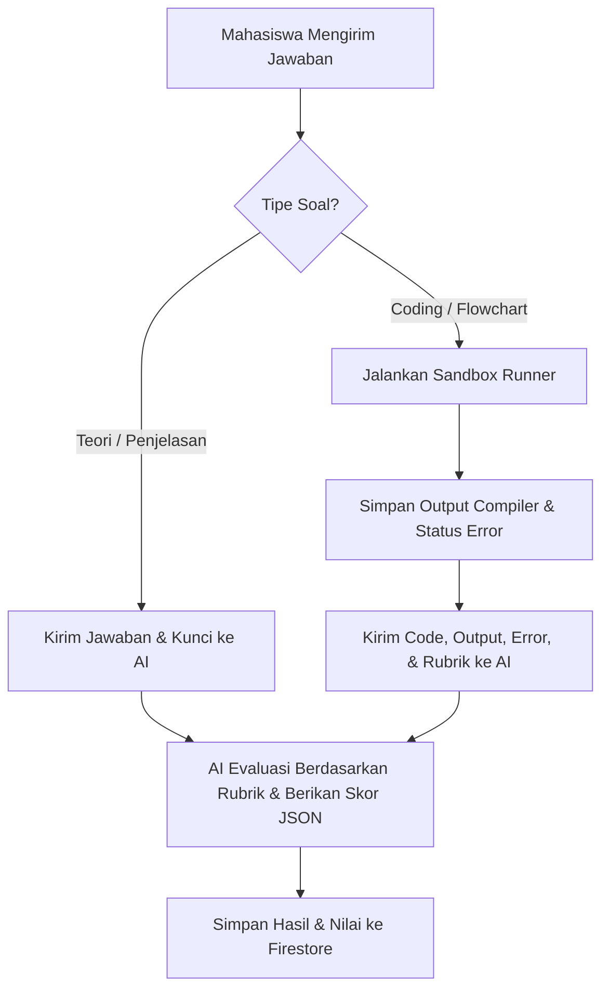

# Product Requirement Document (PRD)
## Fitur Asesmen (Pre-Test, Post-Test, Program Keterampilan, Ujian Praktik) & Monitoring Aktivitas

| Dokumen | Product Requirement Document (PRD) |
|---|---|
| **Fitur** | Menu Asesmen & Monitoring Kordas/Asisten |
| **Status** | Draft (Planning Mode) |
| **Target Pengguna** | Mahasiswa (Student), Asisten Laboratorium (Assistant), Koordinator Asisten (Kordas), Admin |
| **Model Evaluasi** | AI-Powered Grading (Gemini 3.5 Flash / 3-flash-preview) |

---

## 1. Latar Belakang & Tujuan
Untuk mengukur dan mengevaluasi pemahaman mahasiswa secara berkala dan objektif, sistem E-Learning memerlukan fitur asesmen terstruktur yang terpisah dari alur belajar mandiri biasa. Terdapat empat jenis asesmen baru yang dirancang dengan karakteristik jumlah soal, tingkat kesulitan, dan kriteria penilaian yang spesifik. 

Penilaian seluruh asesmen ini akan diotomatisasi menggunakan kecerdasan buatan (AI) untuk menganalisis kebenaran logika, kualitas penjelasan (untuk soal essay/medium), serta fungsionalitas kode program (untuk soal coding) dengan memanfaatkan compiler sandbox C (Wandbox) dan runtime Python (Pyodide). Selain itu, diperlukan sistem monitoring real-time dan log aktivitas bagi staf pengajar (Admin, Kordas, Asisten) untuk mengawasi jalannya tes dan mencegah kecurangan.

---

## 2. Matriks Peran & Hak Akses (Role-Based Access Control)
Sistem memiliki 4 peran pengguna dengan kewenangan sebagai berikut:

| Hak Akses / Fitur | Student (`user`) | Assistant (`asisten`) | Kordas (`kordas`) | Admin (`admin`) |
|---|:---:|:---:|:---:|:---:|
| Mengerjakan Asesmen yang Terbuka | ✅ | ❌ | ❌ | ❌ |
| Memasukkan Token Ujian Praktik | ✅ | ❌ | ❌ | ❌ |
| Melihat Nilai & Riwayat Sendiri | ✅ | ❌ | ❌ | ❌ |
| Memonitor Aktivitas Mahasiswa Real-Time | ❌ | ✅ | ✅ | ✅ |
| Melihat Log Aktivitas Pengguna | ❌ | ✅ | ✅ | ✅ |
| Membuka/Mengunci Menu Asesmen Mahasiswa | ❌ | ✅ | ✅ | ✅ |
| Mengelola Bank Soal Asesmen (CRUD) | ❌ | ❌ | ✅ | ✅ |
| Membuat & Mengelola Token Ujian Praktik | ❌ | ❌ | ✅ | ✅ |
| Konfigurasi Aturan Global / Model AI | ❌ | ❌ | ❌ | ✅ |

---

## 3. Spesifikasi 4 Menu Asesmen
Setiap menu asesmen memiliki struktur, distribusi soal, dan sistem penilaian yang khas.

### A. Pre-Test
* **Tujuan**: Mengukur pemahaman awal mahasiswa sebelum memasuki materi utama.
* **Jumlah Soal**: 5 Soal (1 Easy, 2 Medium, 2 Hard).
* **Alur Pemilihan Soal**: Soal diambil secara acak (randomized) dari bank soal khusus Pre-Test sesuai dengan kriteria kesulitan yang ditentukan.
* **Format Soal & Rubrik Penilaian**:
  1. **Easy (1 Soal - Pilihan Ganda / Jawaban Singkat)**:
     - *Jawaban Benar*: +20 Poin
     - *Jawaban Salah*: +8 Poin
     - *Jawaban Kosong/Tidak Diisi*: 0 Poin
  2. **Medium (2 Soal - Jawaban Singkat + Penjelasan Logika)**:
     - *Jawaban Benar Singkat (Tanpa Penjelasan)*: +10 Poin per soal
     - *Jawaban Benar + Penjelasan Tepat*: +15 Poin per soal
     - *Jawaban Salah + Penjelasan Logis*: +7 Poin per soal
     - *Jawaban Salah*: +3 Poin per soal
     - *Jawaban Kosong*: 0 Poin
  3. **Hard (2 Soal - Analisis Logika + Coding Sederhana / Penjelasan Mendalam)**:
     - *Jawaban Benar Singkat*: +15 Poin per soal
     - *Jawaban Benar + Penjelasan*: +25 Poin per soal
     - *Jawaban Salah + Penjelasan Logis*: +10 Poin per soal
     - *Jawaban Salah*: +5 Poin per soal
     - *Jawaban Kosong*: 0 Poin
* **Total Maksimal Poin**: 20 + (2 * 15) + (2 * 25) = **100 Poin**.

---

### B. Post-Test
* **Tujuan**: Mengukur tingkat penguasaan materi setelah menyelesaikan level tertentu.
* **Jumlah Soal**: 3 Soal (1 Easy, 1 Medium, 1 Hard Coding).
* **Alur Pemilihan Soal**: Diambil acak dari bank soal khusus Post-Test sesuai dengan materi level yang bersangkutan.
* **Format Soal & Rubrik Penilaian**:
  1. **Easy (1 Soal - Pemahaman Teori/Sintaks Dasar)**:
     - *Jawaban Benar*: +20 Poin
     - *Jawaban Salah*: +8 Poin
     - *Jawaban Kosong*: 0 Poin
  2. **Medium (1 Soal - Analisis Kode / Penulisan Logika)**:
     - *Jawaban Benar Singkat*: +20 Poin
     - *Jawaban Benar + Penjelasan*: +35 Poin
     - *Jawaban Salah + Penjelasan Logis*: +15 Poin
     - *Jawaban Salah*: +10 Poin
     - *Jawaban Kosong*: 0 Poin
  3. **Hard Coding (1 Soal - Pembuatan Program Wajib Coding)**:
     - Kode ditulis langsung pada editor terintegrasi (Wandbox / Pyodide).
     - *Dapat Berjalan Tanpa Error (Compiles & Runs)*: +7 Poin
     - *Sesuai dengan Petunjuk / Instruksi Soal*: +25 Poin
     - *Tepat Waktu / Selesai (Memenuhi Kriteria Output)*: +13 Poin
     - *Belum Selesai (Mengirim kode tidak lengkap/tidak sesuai kriteria output)*: +3 Poin
* **Total Maksimal Poin**: 20 + 35 + 45 = **100 Poin**.

---

### C. Program Keterampilan
* **Tujuan**: Menguji kemampuan mahasiwa dalam membangun sebuah program terstruktur berukuran menengah berdasarkan studi kasus atau petunjuk teknis.
* **Jumlah Soal**: 1 Soal Studi Kasus Coding.
* **Format Soal & Rubrik Penilaian (Total 85 Poin)**:
  1. **Dapat Berjalan Tanpa Error**: Maksimal 30 Poin.
     - *Berjalan Sempurna (Lolos semua test case)*: 30 Poin.
     - *Berjalan Sebagian (Beberapa test case gagal / error logika minor)*: 15 Poin.
  2. **Kesesuaian Sintaks & Petunjuk**: Maksimal 35 Poin.
     - Mengevaluasi apakah penulisan sintaks program sesuai dengan best practices instruksi (misal menggunakan struktur perulangan tertentu, tidak melakukan hardcode output, dll.).
  3. **Waktu Pengerjaan & Penyelesaian**:
     - *Selesai Penuh / Tepat Waktu*: +20 Poin.
     - *Belum Selesai (Kriteria fungsional dasar belum terpenuhi)*: +10 Poin.

---

### D. Ujian Praktik
* **Tujuan**: Evaluasi komprehensif akhir praktikum.
* **Akses Keamanan**: Wajib memasukkan token/kode akses (6-digit alphanumeric) yang diberikan oleh Admin/Kordas untuk memulai tes.
* **Jumlah Soal**: 6 Soal, dengan pemetaan materi wajib:
  - **Soal 1**: Modul 1
  - **Soal 2**: Modul 2
  - **Soal 3**: Modul 3
  - **Soal 4**: Modul 4 & 5
  - **Soal 5**: Modul 6
  - **Soal 6**: Menerjemahkan Flowchart ke Program C/Python (FC to Program).
* **Rubrik Penilaian**:
  1. **Soal 1 s.d. Soal 5 (Sama seperti rubrik Post-Test Hard Coding - Maksimal 45 Poin per Soal)**:
     - *Dapat Berjalan Tanpa Error*: +7 Poin
     - *Sesuai dengan Petunjuk*: +25 Poin
     - *Tepat Waktu / Selesai*: +13 Poin
     - *Belum Selesai*: +3 Poin
  2. **Soal 6 (Flowchart to Program - Maksimal 45 Poin)**:
     - Mahasiswa diberikan gambar/deskripsi flowchart dan diminta menulis kodenya.
     - *Dapat Berjalan Tanpa Error*: +7 Poin
     - *Kesesuaian Alur & Logika Flowchart*: +25 Poin (Mengevaluasi keselarasan struktur IF, Loop, atau urutan instruksi dalam program dengan bagan flowchart).
     - *Tepat Waktu / Selesai*: +13 Poin
     - *Belum Selesai*: +3 Poin
* **Total Maksimal Poin**: (5 * 45) + 45 = **270 Poin**.

---

## 4. Sistem Manajemen Aturan & Bank Soal (CRUD)
Disediakan dashboard khusus bagi **Admin/Kordas** untuk mengelola aturan asesmen dan konten soal:
1. **Aturan Asesmen**:
   - Menghidupkan/mematikan asesmen tertentu.
   - Durasi waktu pengerjaan masing-masing menu (timer hitung mundur di sisi mahasiswa).
   - Skema bobot nilai (opsi penyesuaian jika diperlukan).
2. **Manajemen Soal**:
   - CRUD soal yang dikelompokkan berdasarkan menu asesmen (`pre_test`, `post_test`, `skill_program`, `ujian_praktik`).
   - Penentuan tipe soal (`essay`, `short_answer`, `coding`, `flowchart_translation`).
   - Kolom isian soal: Pertanyaan/Instruksi, Tingkat Kesulitan, Modul Asosiasi, Kode Awal (Template), Kode Solusi Referensi, Input/Output Test Cases, dan Parameter Kriteria AI.

---

## 5. Sistem Evaluasi & Penilaian Berbasis AI (AI Grading Engine)
Penilaian jawaban non-pilihan ganda dilakukan dengan alur terintegrasi:



### Prompt AI & Skema Output JSON
AI (Gemini) bertindak sebagai evaluator yang objektif. Prompts yang dikirim ke AI wajib melampirkan parameter rubrik detail yang diisi oleh dosen/kordas. AI akan mengembalikan data terstruktur dalam format JSON agar dapat diparsing langsung oleh backend/client untuk masuk ke database.

**Contoh Skema Respons JSON dari AI**:
```json
{
  "scores": {
    "syntax_ok": 7,
    "instruction_adherence": 25,
    "completion": 13
  },
  "total_score": 45,
  "feedback": "Kode program berjalan dengan baik tanpa error. Seluruh instruksi variabel dan kontrol alur terpenuhi sesuai petunjuk. Kriteria output test case berhasil dilewati.",
  "analysis": {
    "logic_errors": [],
    "good_points": ["Menggunakan pointer secara tepat", "Indotasi rapi"],
    "suggestions": ["Gunakan fungsi pembantu untuk modularitas kode"]
  }
}
```

---

## 6. Dashboard Monitoring & Log Aktivitas (Real-Time)
Halaman khusus bagi Admin, Kordas, dan Asisten untuk mengawasi jalannya asesmen secara real-time.

### A. Monitoring Aktivitas Real-Time
1. **Siapa yang sedang Login (Active Users)**:
   - Menampilkan daftar nama mahasiswa yang saat ini online (berdasarkan tracking status detak jantung/heartbeat login).
2. **Siapa yang sedang Mengerjakan**:
   - Detail pengerjaan: NIM, Nama, Kelas, Menu Asesmen yang sedang dikerjakan (misal: Ujian Praktik), Waktu Mulai, Sisa Waktu, dan status kemajuan pengerjaan (misal: Soal 3/6).
3. **Belum Mengumpulkan (Unsubmitted Tracker)**:
   - Daftar mahasiswa yang memiliki sesi aktif namun waktu pengerjaan hampir habis atau belum menekan tombol Submit.
   - Pilihan bagi Kordas/Admin untuk memaksa pengumpulan (Force Submit) jika durasi ujian telah habis.

### B. Audit Log Activity
Menyimpan dan menampilkan histori tindakan penting dalam sistem:
- `[Login/Logout] NIM - Nama berhasil masuk/keluar sistem.`
- `[Start Test] NIM - Nama memulai pengerjaan Pre-Test.`
- `[Submit Test] NIM - Nama mengumpulkan pengerjaan Post-Test dengan nilai akhir 85.`
- `[Token Generated] Kordas/Admin menghasilkan Token 'A7B2C9' untuk Ujian Praktik.`
- `[Token Used] NIM - Nama menggunakan Token 'A7B2C9' untuk membuka Ujian Praktik.`
- `[Access Modified] Assistant membuka akses Ujian Praktik untuk NIM 123456.`

---

## 7. Sandbox Code Editor & Integrasi Pyodide/C Compiler
Fitur ini memanfaatkan infrastruktur editor kode yang sudah ada:
- **Python**: Dijalankan secara lokal di browser melalui library **Pyodide** (WebAssembly), yang memungkinkan eksekusi kode instan, hemat bandwidth, dan aman tanpa server sandboxing.
- **C Language**: Dikompilasi secara online menggunakan **Wandbox API** dengan compiler `gcc` versi terbaru, mengembalikan output standar (`stdout`/`stderr`) dan status error compiler secara lengkap untuk dievaluasi oleh AI.
- **Fitur Editor**: Mendukung pengetikan tab (insert 2 spasi) dan indentasi otomatis (auto-indent) saat menekan Enter.
